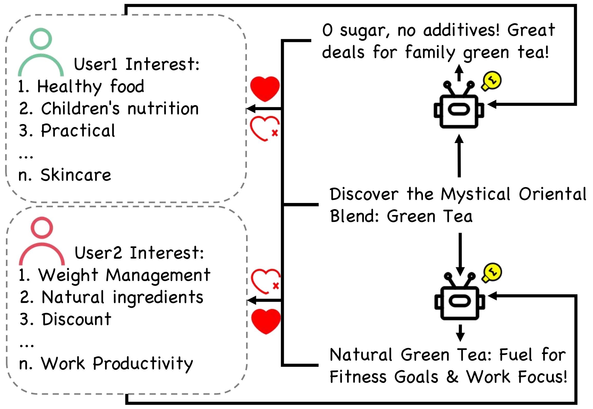
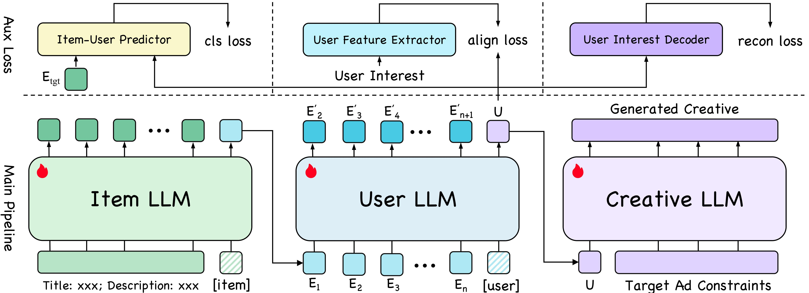

# [HLLM-Creator: Hierarchical LLM-based Personalized Creative Generation](https://arxiv.org/abs/2508.18118)

<div align="center">

[](https://arxiv.org/abs/2508.18118)
[](https://huggingface.co/ByteDance/HLLM)
[]()

<table style="border-collapse: collapse; border: none;">
  <tr>
    <td></td>
    <td></td>
  </tr>
</table>

</div>

## Installation

1. Install packages via `pip3 install -r requirements.txt`. 
Some basic packages are shown below :
```
pytorch==2.3.1
deepspeed==0.14.2
transformers==4.51.0
lightning==2.4.0
flash-attn==2.5.9post1
```
2. Prepare `Personalized Generation` Dataset:
    > Due to data protection restrictions, we are unable to directly open-source the personalized generation data annotated on Amazon Book Reviews. Therefore, we open-source the processed raw user sequence data and data processing scripts to reproduce our results.

    1. Download the [user sequence data](https://huggingface.co/ByteDance/HLLM/tree/main/HLLM_Creator/amazon_books_train) and then run the following scripts sequentially to construct the final training data:
        > Set environment variables `OPENAI_API_BASE_URL`, `OPENAI_API_KEY`, `OPENAI_API_MODEL_NAME`, `OPENAI_API_VERSION` for OpenAI API. Find more details in scripts below.

        1. [code/HLLM_Creator_data_scripts/gpt_userinfo_open.py](code/HLLM_Creator_data_scripts/gpt_userinfo_open.py)
        2. [code/HLLM_Creator_data_scripts/gpt_rewrite_user_open.py](code/HLLM_Creator_data_scripts/gpt_rewrite_user_open.py)
        3. [code/HLLM_Creator_data_scripts/gen_user_open.py](code/HLLM_Creator_data_scripts/gen_user_open.py)

        We also provide a fully synthetic training dataset for verifying code functionality in [synthetic data](https://huggingface.co/ByteDance/HLLM/tree/main/HLLM_Creator/fake_train_data).

    2. The training data is in **parquet** format with the following fields:
        ```bash
        user_profile            object
        original_title          object
        original_description    object
        prompt1                 object
        prompt2                 object
        response                object
        title_list              object
        item_id_list            object
        dtype: object
        ``` 
3. Prepare pre-trained LLM models, such as [TinyLlama](https://github.com/jzhang38/TinyLlama), [Qwen3](https://huggingface.co/Qwen/Qwen3-8B).

## Training
To reproduce our experiments, you can run the script `reproduce/HLLM_Creator/HLLM_Creator.sh`

> Set `master_addr`, `master_port`, `nproc_per_node`, `nnodes` and `node_rank` in environment variables for multinodes training.

> All hyper-parameters (except model's config) can be found in code/REC/utils/argument_list.py and passed through CLI. More model's hyper-parameters are in `IDNet/*` or `HLLM/*`. 

```python
# Item / User / Creative LLM are initialized by specific pretrain_dir.
cd code && python3 main.py \
--config_file overall/LLM_deepspeed.yaml HLLM_Creator/HLLM_Creator.yaml \
--MAX_ITEM_LIST_LENGTH 50 \
--MAX_TEXT_LENGTH 64 \
--MAX_GEN_TEXT_LENGTH 4096 \
--MAX_USER_PROFILE_TEXT_LENGTH 1024 \
--epochs 1 \
--optim_args.learning_rate 2e-5 \
--checkpoint_dir checkpoint_dir \
--gradient_checkpointing True \
--train_batch_size 2 \
--item_pretrain_dir item_pretrain_dir \
--user_pretrain_dir user_pretrain_dir \
--creative_pretrain_dir creative_pretrain_dir \
--train_path train_path \ # must set for HLLM_Creator
--stage 3
```
> Recommend using `--gradient_checkpointing True` and `--stage 3` with deepspeed to save memory.


## Inference
We provide fine-tuned HLLM-Creator for evaluation, you can download from the following links or huggingface.

| Model | Dataset | Weights |
|:---|:---|:---|
|HLLM-Creator | Books | [HLLM-Creator](https://huggingface.co/ByteDance/HLLM/tree/main/HLLM_Creator/pretrained_model)

> Please ensure compliance with the respective licenses of [TinyLlama-1.1B](https://huggingface.co/datasets/choosealicense/licenses/blob/main/markdown/apache-2.0.md) and [Qwen3](https://huggingface.co/Qwen/Qwen3-8B/blob/main/LICENSE) when using corresponding weights.

Clustering and generate personalized title through `reproduce/HLLM_Creator/HLLM_Creator_eval.sh`.
```bash
# use faiss for clustering, please pay attention to your python version
pip3 install https://github.com/kyamagu/faiss-wheels/releases/download/v1.7.3/faiss_gpu-1.7.3-cp311-cp311-manylinux_2_17_x86_64.manylinux2014_x86_64.whl

bash reproduce/HLLM_Creator/HLLM_Creator_eval.sh HLLM-Creator_weight
```

Then you can compare personalized title and original title by the following command.
```python
python3 code/HLLM_Creator_eval_scripts/gpt_eval_open.py \
    --input_file output_cluster.parquet \
    --key1 original_title \
    --key2 llm_output \
    --mprun
```

You should be able to reproduce the following results.

| Method A     | Method B     | Good | Same | Bad | Adv   |
|--------------|--------------|------|------|-----|-------|
| HLLM-Creator | Origin title | 353  | 91   | 56  | 59.4% |

## Citation

If our work has been of assistance to your work, feel free to give us a star ⭐ or cite us using :  

```
@article{HLLM-Creator,
title={HLLM-Creator: Hierarchical LLM-based Personalized Creative Generation},
author={Junyi Chen and Lu Chi and Siliang Xu and Shiwei Ran and Bingyue Peng and Zehuan Yuan},
journal={arXiv preprint arXiv:2508.18118},
year={2025}
}
```